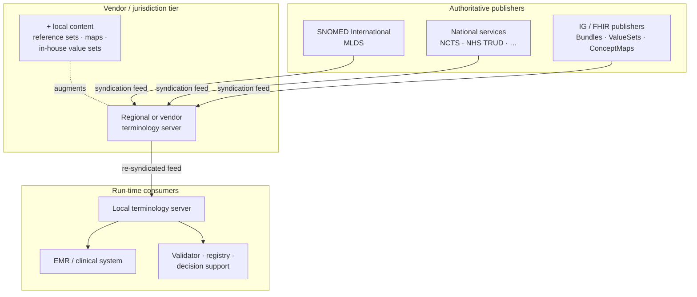

<style>
div.mermaid iframe {
  width: 100% !important;
  height: 450px !important;
  border: 0 !important;
}
</style>

### Terminology Syndication Feed

This Implementation Guide specifies the **wire format** that
terminology publishers use to advertise what they have for
download — and that downstream terminology servers, vendors, and
clinical systems use to keep their copies current.

Clinical terminologies such as SNOMED CT, LOINC, and various FHIR resources are updated regularly,
and systems that depend on them — terminology servers, EHRs, decision support tools, and validators — need a reliable way to track and retrieve new releases.
The IG specifies a machine-readable catalogue based on the Atom format,
in which each entry describes one item of content with a stable identifier,
a version, a category, a download link, and a cryptographic hash for verifying integrity.
Consumers poll the catalogue on their own schedule and pull only what they do not already have,
which means re-reading the catalogue causes no duplicate work.
The IG also defines how entries align with FHIR and SNOMED CT metadata,
how publishers signal that a previously released item has been withdrawn,
and how per-entry permission tags can restrict access.
It specifies the format only, leaving transport, authentication, pagination, and the behaviour of any particular software outside its scope.

If syndication is new to you, start here. The technical surface —
namespaces, profile declarations, field-by-field rules — comes
later in the guide.

### Why syndicate at all?

Clinical terminologies change. SNOMED CT International now
produces a new release every month;
many SNOMED CT national Editions and the AMT/dm+d
medicines extensions are usually monthly; FHIR `CodeSystem`,
`ValueSet`, `ConceptMap`, and packaged `Bundle` artefacts ship on
their authors' own cadence. Every system that uses this content —
terminology servers, EMRs, decision support, registries, code
validators — needs to track those releases.

The naive answer is **manual download**: an operator signs in to
the publisher's portal, fetches a ZIP, copies it onto a server,
runs an import. It works for one system and one publisher. It
does not scale:

- Different operators end up on different versions ("version
  drift"), and clinical data coded against one version doesn't
  always validate against another.
- Loading a SNOMED CT release into a terminology server can be
  computationally or resource intensive — building these indexes
  once and sharing the result reduces burden.
- Each new publisher — national extensions, derivative reference
  sets, packaged FHIR bundles, jurisdictional maps — multiplies
  the manual effort.

Syndication of terminology content is a way to manage these issues.
SNOMED International states:

> "manually downloading RF2 zip files on secure portals can be
> significantly improved by implementing an NTS, streamlining
> terminology server setup, facilitating updates, and preventing
> version mismatches." ([SNOMED International][si-nts])

### What is a syndication feed?

A feed is a machine-readable catalogue. Australia's National
Clinical Terminology Service (NCTS) defines syndication
as "the transfer of terminology data between terminology
servers" ([NCTS Guide for Implementers, §3.5][ncts-impl]) — a
publisher exposes a list of available content, and a consumer
polls that list and pulls what it needs.

The feed is a sequence of **entries**. Each entry describes one
**content item** — a SNOMED CT RF2 package, a FHIR CodeSystem, a
ValueSet, a Bundle, an Ontoserver binary index — and carries the
information a downstream system needs in order to decide whether
to act on it: identifier, version, publication date, content type,
dependencies, hash, and a link to the actual download.

A consumer that already holds version *N* of a content item
ignores that entry on the next poll and only does work when
version *N+1* appears. The feed is **idempotent** in that sense:
re-reading it never causes duplicate work.

### Pull, not push

Syndication is **pull-based**. The publisher does not reach into
the consumer's server. The consumer decides:

- *when* to look (start-up, on a schedule, manually, on an
  event);
- *what* to pull (the whole feed, only the latest of each item,
  only items below a size threshold, only items it is licensed
  for);
- *where* to load it (a primary terminology server, a read-only
  replica, a vendor's distribution pipeline).

That separation is what allows the model below.

### A layered ecosystem

Because consumption is decoupled from publication, syndication
chains naturally:




1. An **authoritative publisher** — SNOMED International
   ([MLDS](https://mlds.ihtsdotools.org)), the Australian Digital
   Health Agency ([NCTS](https://www.healthterminologies.gov.au)),
   NHS England ([TRUD][trud]), or an IG publisher releasing a
   FHIR Bundle — exposes a feed of releases.
2. A **vendor or jurisdiction** subscribes to that feed, pulls
   the content into its own infrastructure, and *optionally
   re-publishes* its own feed: the upstream content plus
   regional reference sets, jurisdictional maps, in-house value
   sets, or organisation-specific bundles.
3. **Operators of clinical systems** subscribe to the
   second-tier feed, so their run-time queries hit a local
   terminology server rather than the national one.

The NCTS describes this as decentralisation of the distribution
responsibility: NCTS "can serve the role of seeding top-level
terminology servers, which can then expose their own
syndication feeds to terminology consumers within their own
areas of jurisdiction. Syndication feeds can also be augmented
with localised, context-specific terminology sets at lower
levels of the tree" ([NCTS Guide for Implementers,
§3.5][ncts-impl]).

The pattern shows up everywhere: "most production EHRs cache
the national content in a local Terminology Server instance
while still subscribing to the NTS feed for incremental
updates" ([SNOMED International][si-nts]).

### Why a shared format matters

A feed format is only useful if more than one publisher and more
than one client implement it. In practice, several major
terminology publishers — NCTS, SNOMED International's MLDS,
Ontoserver-based deployments worldwide — converged on the same
Atom-based profile, originally developed within NCTS. A single
client implementation can talk to any of them.

This Implementation Guide is the place that profile is
specified independently of any particular publisher or vendor.
Its job is to make the convergence durable: one place to read
what an entry means, what a category term implies, when a hash
is required, and how the FHIR-aware extensions align with
`CodeSystem` / `ValueSet` / `ConceptMap` metadata.

### The format, concretely

The feed is **Atom 1.0** ([RFC 4287](https://www.rfc-editor.org/rfc/rfc4287))
extended with three namespaces:

| Prefix | Namespace URI | Purpose |
|--------|---------------|---------|
| `ncts` | `http://ns.electronichealth.net.au/ncts/syndication/asf/extensions/1.0.0` | Terminology metadata: canonical identifier, version, FHIR version, FHIR profile, bundle interpretation, SHA-256 hash, ASF profile declaration |
| `sct`  | `http://snomed.info/syndication/sct-extension/1.0.0` | SNOMED CT package dependencies and MD5 hashes |
| `onto` | `http://ontoserver.csiro.au/syndication/` | Per-entry permissions and per-link validation state |

Together these are referred to as the **NCTS Atom Syndication Format
(ASF) profile**, currently at version `1.0.0`. Feeds that conform to
this profile declare it via the `<ncts:atomSyndicationFormatProfile>`
element on the feed:

```xml
<ncts:atomSyndicationFormatProfile>
  http://ns.electronichealth.net.au/ncts/syndication/asf/profile/1.0.0
</ncts:atomSyndicationFormatProfile>
```

### Scope

This guide describes:

- The **shape** of feeds, entries, links, and categories.
- The **meaning** of each field and each extension element.
- The **constraints** that hold across fields — including alignment
  with FHIR canonical resource metadata.
- The **controlled vocabularies** used in `<category>`.

It does not describe any specific publishing or consuming software.

### Reading guide

- [Feed Format](feed-format.html) — feed-level elements
- [Entry Format](entry-format.html) — entry-level elements and
  cross-field constraints
- [Category Schemes](categories.html) — the NCTS ASF scheme and the
  full set of content-type terms
- [NCTS ASF Extensions](ncts-extensions.html),
  [SNOMED CT Extensions](sct-extensions.html),
  [Ontoserver Extensions](onto-extensions.html) — element-by-element
  reference for each extension namespace
- [Security](security.html) — the per-entry permission mechanism
- [Examples](examples.html) — annotated real-world feed fragments

### Known public feeds

Feeds known to conform (in whole or in part) to this format:

| Publisher | Feed URL | Notes |
|-----------|----------|-------|
| SNOMED International | [`https://mlds.ihtsdotools.org/api/feed`](https://mlds.ihtsdotools.org/api/feed) | Member Licensing & Distribution Service (MLDS); SNOMED CT International Edition and member national/affiliate packages. Authentication required for downloads. |
| Australian Digital Health Agency / NCTS | [`https://api.healthterminologies.gov.au/syndication/v1/syndication.xml`](https://api.healthterminologies.gov.au/syndication/v1/syndication.xml) | National Clinical Terminology Service; SNOMED CT-AU, AMT, FHIR resources. |

Publishers of additional public feeds are invited to raise a PR against
this IG to be listed here.

### Further reading

- [NCTS Guide for Implementers][ncts-impl] — §3.5 "Terminology
  Syndication" is the canonical conceptual introduction.
- [Ontoserver — Syndication and content ingestion][onto-syn] —
  operator-level view, including why pre-built indexes are
  distributed rather than re-built.
- [SNOMED International — Role of a National Terminology
  Server][si-nts] — the strategic case for an authoritative,
  syndicated national feed.
- [NHS England TRUD][trud] — the UK reference data distribution
  service.

[ncts-impl]: https://www.healthterminologies.gov.au/library/DH_3247_2020_NCTS-Guide-for-Implementers_v1.1.pdf
[onto-syn]: https://ontoserver.csiro.au/site/technical-documentation/ontoserver-technical-documentation/syndication-and-content-ingestion/
[si-nts]: https://docs.snomed.org/implementation-guides/implementation-fact-sheets/implementation-strategy/what-is-the-role-of-a-national-terminology-server
[trud]: https://isd.digital.nhs.uk/trud/user/guest/group/0/home
